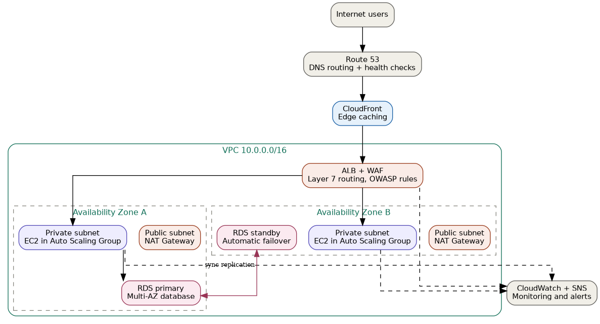

# Scalable Web Application with ALB and Auto Scaling

AWS Solutions Architect – Associate graduation project. A production-style,
highly available web application deployed on EC2 behind an Application Load
Balancer, with Auto Scaling, a Multi-AZ RDS database, CloudFront edge caching,
and WAF protection — all inside a purpose-built VPC.

## Architecture



**Traffic flow:** Internet users → Route 53 (DNS) → CloudFront (edge cache) →
Application Load Balancer + WAF → EC2 instances in an Auto Scaling Group
(private subnets, 2 Availability Zones) → RDS Multi-AZ (private subnets).

| Layer | AWS services | Purpose |
|---|---|---|
| Networking | VPC, public/private subnets, IGW, NAT Gateway (per AZ) | Network isolation, outbound internet access for private instances |
| Edge | Route 53, CloudFront | DNS + global caching, lower latency |
| Compute | EC2, Auto Scaling Group, Launch Template | Scalable, self-healing web tier |
| Load balancing | Application Load Balancer, Target Groups | Layer 7 routing, health checks |
| Security | WAF, Security Groups, NACLs, Systems Manager | Defense in depth, no exposed SSH |
| Data | RDS (Multi-AZ) | Managed relational database with automatic failover |
| Observability | CloudWatch, SNS | Dashboards, alarms, email notifications |

The diagram was generated from `docs/generate_diagram.py` (Graphviz). Re-run
it any time the architecture changes: `python3 docs/generate_diagram.py`.

## Repository structure

```
.
├── README.md                     This file
├── docs/
│   ├── architecture-diagram.png  Rendered architecture diagram
│   └── generate_diagram.py       Script that generates the diagram above
├── terraform/                    Infrastructure as code (all AWS resources)
│   ├── providers.tf
│   ├── variables.tf
│   ├── vpc.tf
│   ├── security_groups.tf
│   ├── alb.tf
│   ├── waf.tf
│   ├── asg.tf
│   ├── rds.tf
│   ├── cloudfront.tf
│   ├── route53.tf
│   ├── monitoring.tf
│   ├── outputs.tf
│   └── terraform.tfvars.example
├── app/                           Sample Node.js application deployed to EC2
│   ├── server.js
│   └── package.json
├── scripts/
│   └── user_data.sh              EC2 bootstrap script (installs & runs the app)
└── .github/workflows/
    └── terraform-validate.yml    CI check: fmt + validate on every push
```

## Prerequisites

- An AWS account (Free Tier is enough for everything except RDS Multi-AZ,
  which incurs a small hourly cost — see **Cost notes** below)
- [Terraform](https://developer.hashicorp.com/terraform/downloads) >= 1.5
- AWS CLI configured with credentials (`aws configure`)
- (Optional) A registered domain in Route 53 if you want the custom-domain /
  HTTPS path

## Deployment

1. **Clone and configure**
   ```bash
   git clone <your-repo-url>
   cd scalable-webapp/terraform
   cp terraform.tfvars.example terraform.tfvars
   # edit terraform.tfvars with your values
   export TF_VAR_db_password="choose-a-strong-password"
   ```

2. **Initialize and review the plan**
   ```bash
   terraform init
   terraform plan
   ```

3. **Apply**
   ```bash
   terraform apply
   ```
   This takes roughly 10–15 minutes (RDS Multi-AZ and CloudFront are the
   slowest resources to provision).

4. **Get the URL**
   ```bash
   terraform output site_url
   ```

5. **Tear down** (important on a Free Tier account, to avoid charges)
   ```bash
   terraform destroy
   ```

## Accessing EC2 instances securely

There is no bastion host and no open SSH port. Instances are managed through
**Systems Manager Session Manager**:

```bash
aws ssm start-session --target <instance-id>
```

This works because the Launch Template attaches an IAM instance profile with
the `AmazonSSMManagedInstanceCore` policy (see `terraform/asg.tf`).

## How Auto Scaling responds to load

The Auto Scaling Group uses a **target tracking policy** on average CPU
utilization (default target: 50%, see `var.cpu_target_value`). When average
CPU across the group rises above the target, the ASG launches more instances
(up to `asg_max_size`); when it drops, it scales back in (down to
`asg_min_size`). The ALB health check on `/health` ensures only healthy
instances receive traffic.

## Security notes

- WAF (`terraform/waf.tf`) attaches AWS managed rule groups (Common Rule Set,
  Known Bad Inputs, SQL injection) plus a rate-based rule (2000 req / 5 min
  per IP) to the ALB.
- Security groups are layered: ALB accepts 80/443 from the internet, EC2
  accepts port 80 **only from the ALB's security group**, RDS accepts 3306
  **only from the EC2 security group**.
- EC2 metadata service is locked to IMDSv2 (`http_tokens = "required"`).
- RDS storage is encrypted at rest (`storage_encrypted = true`).
- The database password is never hardcoded — pass it via `TF_VAR_db_password`
  or a secrets manager, never commit it in `terraform.tfvars`.

## Notes from a real deployment

A few adjustments were needed on a brand-new AWS account, and are already
reflected in this repo:

- **CloudFront**: new/unverified AWS accounts are sometimes blocked from
  creating CloudFront distributions until AWS Support verifies the account.
  Set `enable_cloudfront = false` in your `terraform.tfvars` to skip it — the
  app is still reachable via the ALB DNS name (`terraform output alb_dns_name`
  / `site_url`). Once your account is verified, set it back to `true` and
  re-run `terraform apply`.
- **RDS backup retention**: some free-tier / new accounts reject a
  `backup_retention_period` above 1 day. This repo defaults to `1`; raise it
  once your account allows it.
- **`/api/db-check` and the database password**: the EC2 user data script
  intentionally does **not** write `DB_PASSWORD` to `/etc/app.env` in
  plaintext (see the comment in `scripts/user_data.sh`). This means
  `/api/db-check` will return a database authentication error out of the box
  — that's expected, not a bug. The `/` and `/health` endpoints work
  regardless, since they don't touch the database. To make `/api/db-check`
  succeed, wire up AWS Secrets Manager: store the DB password there, grant
  the EC2 IAM role `secretsmanager:GetSecretValue`, and fetch it in
  `user_data.sh` at boot instead of skipping it.

## Cost notes

This stack is **not** entirely free-tier:
- RDS Multi-AZ roughly doubles single-AZ RDS cost.
- NAT Gateways bill hourly plus per-GB data processed (one per AZ here, for
  high availability — you can drop to a single NAT Gateway to save cost in a
  learning environment).
- CloudFront and data transfer have a modest free tier allowance beyond which
  charges apply.

Run `terraform destroy` when you're done testing.

## Learning outcomes demonstrated

- Designing a VPC with correct subnet, route table, and NAT Gateway placement
- Building a highly available architecture across two Availability Zones
- Configuring ALB listener rules and target group health checks
- Implementing Auto Scaling with a target tracking policy
- Securing the application with WAF, layered Security Groups, and private
  subnets
- Using Systems Manager Session Manager instead of a bastion host

## License

MIT — see [LICENSE](LICENSE).
